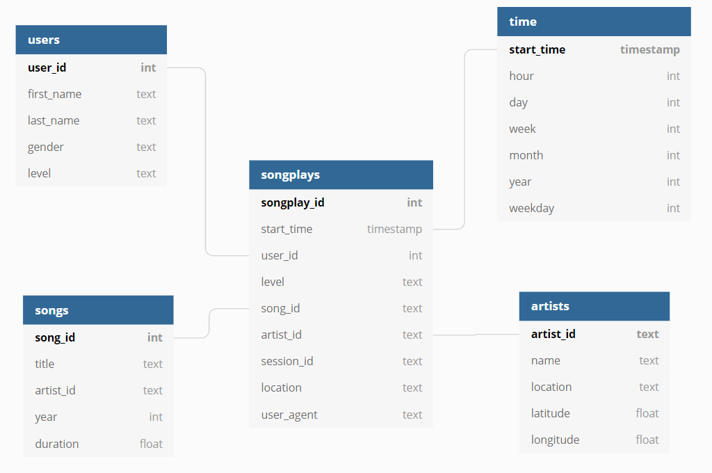

# Sparkify Redshift Data Warehouse

## Contents

1. [Introduction](#Introduction)
2. [Project Description](#motivation)
3. [Source Data](#Datasets)
4. [Database Schema](#Schema)
5. [Scripts](#Scripts)
6. [Getting Started](#Started)


## Introduction<a name="installation"></a>

A music streaming startup, Sparkify, has grown their user base and song database and want to move their processes and data onto the cloud. Their data resides in S3, in a directory of JSON logs on user activity on the app, as well as a directory with JSON metadata on the songs in their app.

## Project Description<a name="motivation"></a>

This project is to create an ETL pipeline that extracts their data from S3, stages them in Redshift, and transforms data into a set of dimensional tables for their analytics team to continue finding insights in what songs their users are listening to. First, we define fact and dimension tables for a star schema for a particular analytic focus, then load data from S3 to staging tables on Redshift and execute SQL statements that create the analytics tables from these staging tables

## Source Data <a name="Datasets"></a>

There are two datasets that reside in S3. Here are the S3 links for each:

Song data: `s3://udacity-dend/song_data`
Log data: `s3://udacity-dend/log_data`
Log data json path: `s3://udacity-dend/log_json_path.json`

### Song Dataset

The first dataset, resides in `s3://udacity-dend/song_data`, is a subset of real data from the [Million Song Dataset](http://millionsongdataset.com/). Each file is in JSON format and contains metadata about a song and the artist of that song. The files are partitioned by the first three letters of each song's track ID. For example, here are filepaths to two files in this dataset.

`song_data/A/B/C/TRABCEI128F424C983.json`</br>
`song_data/A/A/B/TRAABJL12903CDCF1A.json`

And below is an example of what a single song file, TRAABJL12903CDCF1A.json, looks like.

```json
{"num_songs": 1, "artist_id": "ARJIE2Y1187B994AB7", "artist_latitude": null, "artist_longitude": null, "artist_location": "", "artist_name": "Line Renaud", "song_id": "SOUPIRU12A6D4FA1E1", "title": "Der Kleine Dompfaff", "duration": 152.92036, "year": 0}
```

### Log Dataset

The second dataset, resides in s3://udacity-dend/log_data, consists of log files in JSON format generated by this [event simulator](https://github.com/Interana/eventsim) based on the songs in the dataset above. These simulate activity logs from a music streaming app based on specified configurations.

The log files are partitioned by year and month. For example, here are filepaths to two files in this dataset.

`log_data/2018/11/2018-11-12-events.json`</br>
`log_data/2018/11/2018-11-13-events.json`


And below is an example of what the data in a log file, 2018-11-12-events.json, looks like.


## Database Schema <a name="Schema"></a>

### Fact Table
1. **songplays** - Records in log data associated with song plays i.e. records with page NextSong.</br>
songplay_id, start_time, user_id, level, song_id, artist_id, session_id, location, user_agent

### Dimension Tables
2. **users** - Users in the app.</br>
user_id, first_name, last_name, gender, level

3. **songs** - Songs in music database.</br>
song_id, title, artist_id, year, duration

4. **artists** - Artists in music database.</br>
artist_id, name, location, latitude, longitude

5. **time** - Timestamps of records in songplays broken down into specific units.</br>
start_time, hour, day, week, month, year, weekday



## Scripts <a name="Scripts"></a>

- **create_cluster.py** - Create an IAM role and a Redshift cluster.
- **create_tables.py** - Creates new staging tables and database schema, removes previous table if exists, 
- **etl.py** - Inserting data into database by querying the staging tables.
- **sql_queries.py** - Stores all query commands, that are used in staging table creation, database removal, creation and insertion data from staging tables, imported into create_tables.py and etl.py.
- **delete_cluster.py** - Delete the Redshift cluster and the IAM role.
- **dwh_template.cfg** - A configuration file that needs to be modified before started.

## Getting Started <a name="Started"></a>

1. Open dwh_template.cfg, enter values for the following parameter, then rename the file as dwh.cfg.
`[CLUSTER]
DB_NAME=<ENTER VALUE>
DB_USER=<ENTER VALUE>
DB_PASSWORD=<ENTER VALUE>
CLUSTER_IDENTIFIER=<ENTER VALUE>

[IAM_ROLE]
IAM_ROLE_NAME=<ENTER VALUE>

[AWS]
AWS_ACCESS_KEY_ID=<ENTER VALUE>
AWS_SECRET_ACCESS_KEY=<ENTER VALUE>
`
2. Run create_cluster.py, to create an IAM role and a Redshift cluster. 
`python create_cluster.py`

3. Run create_tables.py, to create a schema. 
`python create_tables.py`

4. Run etl.py, to load staging tables from S3 to the schema, then insert data by querying the staging tables.
`python create_etl.py`

5. You can write a SQL to test the database, if everything done, finally run delete_cluster.py to delete the Redshift Cluster and the IAM role.
`python delete_cluster.py`